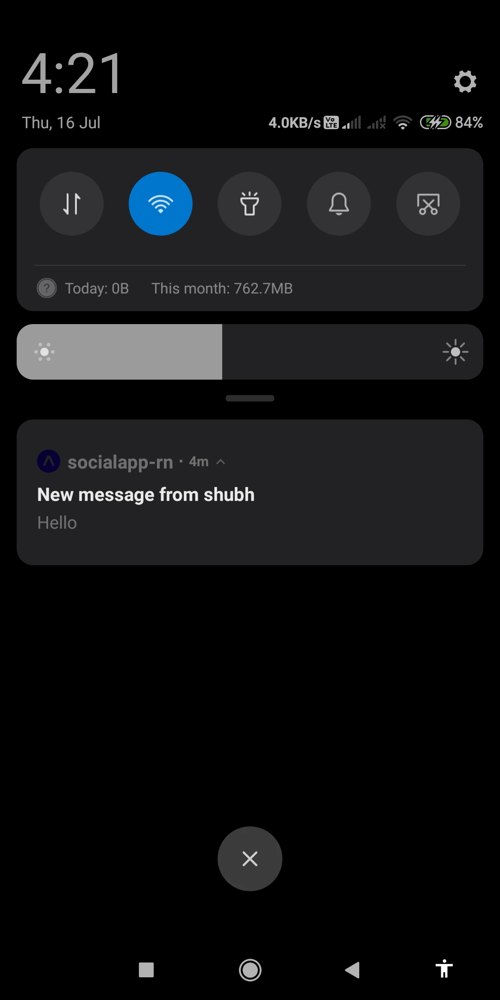

## Features

* Authentication using JWT.
* Forgot password.
* Edit your profile.
* Follow / Unfollow users.
* create / edit / delete posts.
* create / delete comments.
* Like / Unlike posts.
* Personal chat with users.
* Notifications on new messages.

## Demo

<div align="center">

<h4 align="center">Signup Screen &nbsp&nbsp&nbsp&nbsp | &nbsp&nbsp&nbsp&nbsp Home Screen &nbsp&nbsp&nbsp&nbsp | &nbsp&nbsp&nbsp&nbsp Profile Screen</h4>


<h4 align="center">User Posts Screen &nbsp&nbsp&nbsp&nbsp | &nbsp&nbsp&nbsp&nbsp User Stats Screen &nbsp&nbsp&nbsp&nbsp | &nbsp&nbsp&nbsp&nbsp Find People Screen</h4>


<h4 align="center">User Chats List Screen &nbsp&nbsp&nbsp&nbsp | &nbsp&nbsp&nbsp&nbsp Chat Screen &nbsp&nbsp&nbsp&nbsp | &nbsp&nbsp&nbsp&nbsp Comments Screen</h4>


<h4 align="center">Create Post Screen &nbsp&nbsp&nbsp&nbsp | &nbsp&nbsp&nbsp&nbsp Notification on new message</h4>



</div>


## Run project locally

* clone this Repository by `git clone https://github.com/shahshubh/SocialApp-React-Native.git`.
* Change directory `cd SocialApp-React-Native`
* Make sure you have expo-cli installed. If not run `npm install -g expo-cli`
* Install the dependencies using `npm install`
* create new file env.js in root directory and add
    ```javascript
    const vars = {
        apiUrl: "https://socialapp-serverr.herokuapp.com",
        defaultImageUri: "https://socialapp-serverr.herokuapp.com/static/images/defaultprofile.jpg"
    };

    export default vars;
    ```
* Run `npm start`
* Then type in terminal `a` to run on android emulator, `i` to run on ios simulator.

For more info read `https://reactnative.dev/docs/getting-started`
